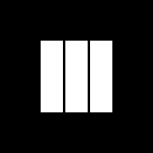

  

<h1 align="center">MOTO</h1>

  A minimal Bitcoin wallet for everyday transactions. 
  <a href="https://motowallet.app"><strong>motowallet.app</strong></a>

## Why MOTO

- **Non-custodial.** MOTO never holds your keys. Your bitcoin is recorded on public ledgers under your own identity.
- **No account or email.** Sign in with a passkey through [Internet Identity](https://id.ai). There's no password to leak and no personal data to hand over.
- **Instant MOTO to MOTO.** Sending to another MOTO wallet arrives in seconds, powered by ckBTC, with no Bitcoin miner fees.

## What you can do

- **Receive** bitcoin with your own deposit address and QR code, and request a specific amount.
- **Send** to any Bitcoin address, or to another MOTO user. MOTO picks the route for you: an instant ckBTC transfer when the address belongs to a MOTO wallet, a regular Bitcoin withdrawal otherwise.
- **See every fee before you confirm,** including what the recipient actually receives on a Bitcoin withdrawal.
- **Track your history,** with withdrawals marked as pending until they confirm on the Bitcoin network.
- **Use it your way:** 20 display currencies, 5 languages (English, 中文, हिन्दी, Español, Français), on phone or desktop.

## How it works

MOTO runs as smart contracts (canisters) on the [Internet Computer](https://internetcomputer.org). The app itself is served from a canister, with no traditional servers.

Your balance is held as **ckBTC**, a token on the Internet Computer backed one-to-one by real bitcoin held by the protocol. Depositing bitcoin to your MOTO address converts it to ckBTC. Withdrawing converts it back and sends real bitcoin to the address you choose. Transfers between MOTO wallets stay on the Internet Computer, which is why they're instant.

You sign in with Internet Identity, so your wallet is tied to your passkey rather than to an email address or password.

## Fees

| | You pay | Recipient gets |
| --- | --- | --- |
| **To another MOTO wallet** | Amount + 0.5% app fee (capped at US$100) + a 10-sat network fee per transfer | The full amount |
| **To a Bitcoin address** | Amount + 0.5% app fee (capped at US$100) + small network fees | The amount minus the ckBTC minter fee and the Bitcoin miner fee |

Every fee is shown on the confirm screen before you send. The app fee is only charged after your send succeeds.

## Good to know

- **Back up your login.** Your wallet is tied to your Internet Identity. Add a recovery phrase or a second device at [id.ai](https://id.ai) (the app has a "Back Up Login" link). If you lose your passkey without one, nobody, including MOTO, can restore access to your funds.
- **Transactions are final.** Bitcoin and ckBTC transfers can't be reversed, so check the address before you send.
- **Use it for everyday amounts,** not your life savings.
- **Not available everywhere.** MOTO can't be used from regions under comprehensive sanctions.

The full [Terms of Service and Privacy Policy](https://motowallet.app) are in the app's menu.

## Open source

MOTO is open source under the [MIT License](LICENSE). The MOTO name and logo are not covered by the license.

Want to run it locally or contribute? Start with [CONTRIBUTING.md](CONTRIBUTING.md). Found a security issue? Please email hello@motowallet.app rather than opening a public issue.
